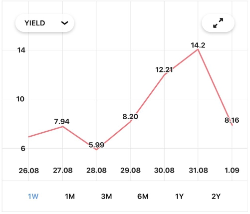

# Второе задание

## График облигации

Дан макет графика облигации:

## Задача

Создать компонент по макету , который реализует следующие функции:

* на вход получает идентификатор облигации (ISIN) и отображает график
* получает данные об облигации из API по идентификатору облигации (ISIN) и
отображает их на карточке,
* позволяет выбрать период за который строится график (количество данных
должно, соответственно, изменяться),
* позволяет изменить параметр, по которому строится график (Yield, Price).
Данные должны соответственно меняться
* нажатие на кнопку fullscreen можно не реализовывать
Комментарии к задаче
* язык решения задачи можно выбрать самостоятельно, поддерживаемые версии iOS 11+
* библиотеку для построения графика можно выбрать любую или рисовать самостоятельно
* данные для графика можно сгенерировать случайным образом и передавать вместо ответа от API
* все спорные моменты решайте в пользу уменьшения времени на выполнения задания и упрощения кода.
 
## Ожидаемое решение

* компонент используется на ViewController
* проект должен собираться и запускаться на iPhone
* код приложения в репозитории на GitHub.